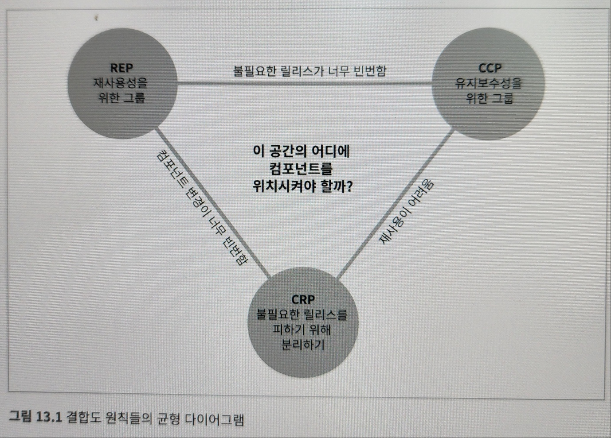
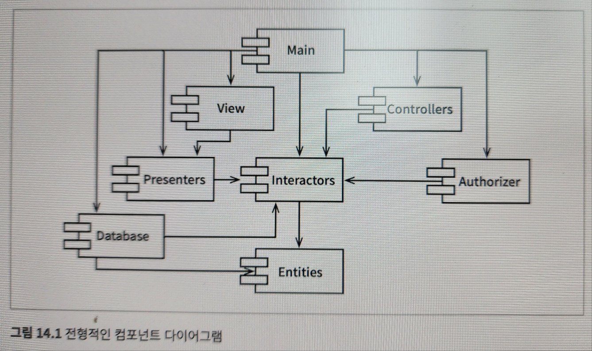
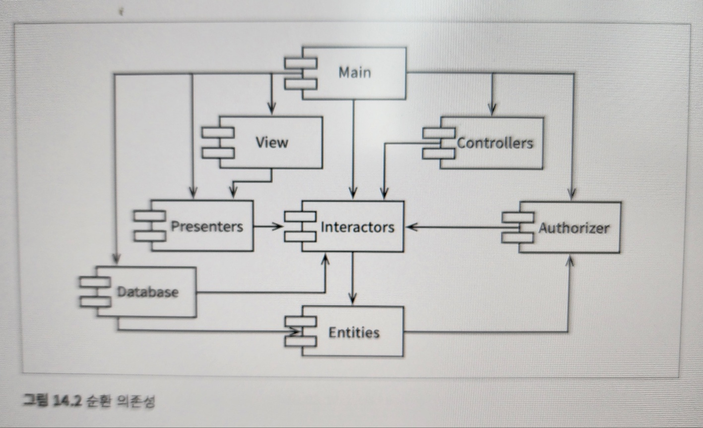
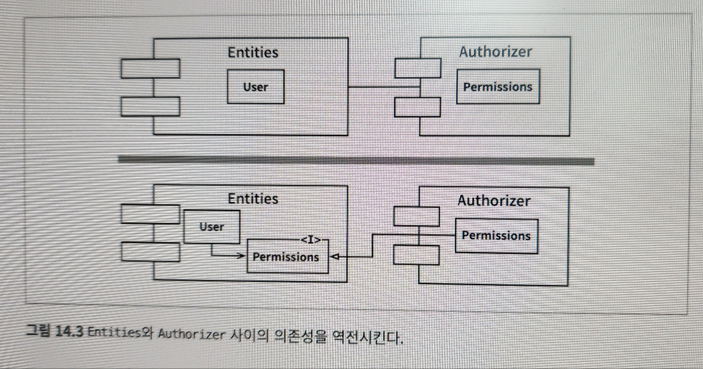
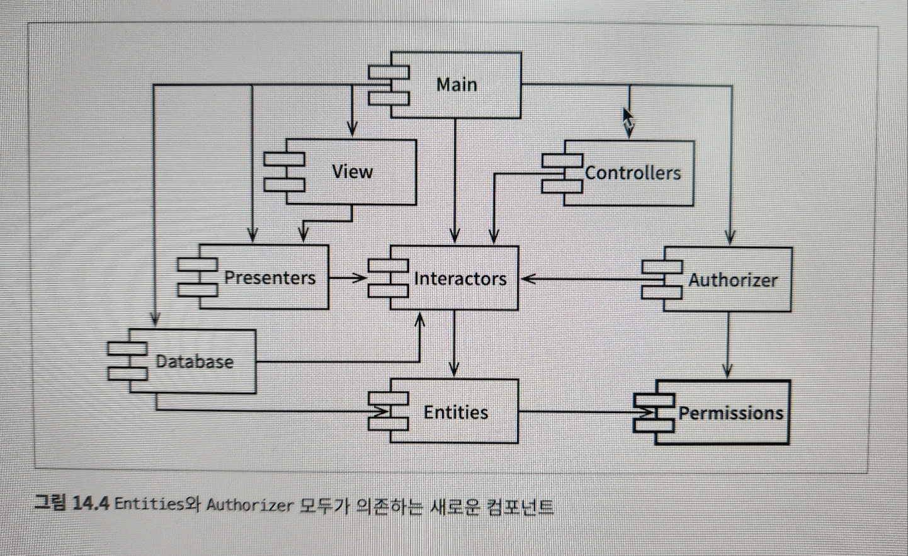
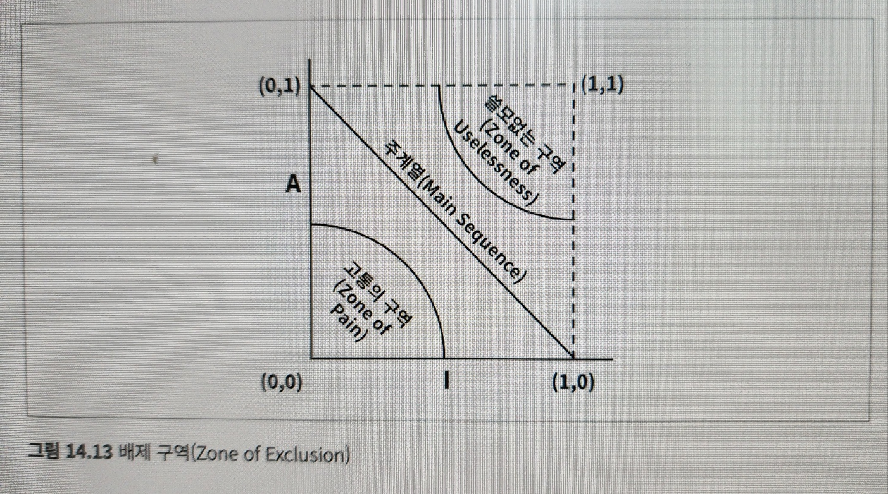

# 12장 컴포넌트

- 가장 작은 배포 단위
- 자바의 경우 jar

## 컴포넌트의 간략한 역사

- 개발 초창기에는 메모리에서의 프로그램 위치와 레이아웃을 프로그래머가 직접 제어
- 프로그램이 로드될 주소를 선언하는 오리진 구문이 있어야 했다.

```java
       *200
       TLS
START, CLA
       TAD BUFR
       JMS GETSTR
       CLA
       TAD BUFR
       JMS PUTSTR
       JMP START
BUFR,  3000

GETSTR, 0
        ...
```

- *200의 명령어가 메모리 주소 200*8 에 로드할 코드를 생성하라고 컴파일러에 알려주는 역할을 한다
- 요즘에는 메모리가 어디에 로드될건지 같은 부분은 고민하지 않는다
- 과거에는 장치는 느리고 메모리가 너무 비쌌고, 컴파일러는 소스 코드 전체를 여러번 읽었다
- 그리고 한번 할당한 메모리를 바꿀 수가 없었다
- 문제는 메모리가 너무 작아서 소스 전체를 메모리에 상주를 시킬 수 없다는 건데, 컴파일러는 느린 장치를 이용해 소스코드를 여러번 읽는 작업을 했다
- 여기서 컴파일 시간 단축을 위해서 프로그래머는 함수 라이브러리의 소스코드를 분리시키기 시작함
- 말 그대로 메모리를 숫자단위로 쪼개서 할당하고 소스를 짠 것
- 근데 메모리가 너무 작고 쓸 공간이 적어서 결국 문제가 발생함

## 재배치성

- 요 문제를 해결하기 위해 재배치가 가능한 바이너리를 사용한 것
- 지능적인 로더를 사용해 메모리에 재배치할 수 있는 형태의 바이너리를 생성하도록 컴파일러를 수정
- 이제 애플리케이션과 라이브러리 위치를 로더에게 지시할수 있게 됨
- 외부 정의를 로드할 위치가 정해지는 순간 로더가 외부 참초를 외부 정의에 링크시킬 수 있게 됨
- 링킹로더가 탄생

## 링커

- 이제 링킹 로더의 등장으로 프로그램을 개별적으로 컴파일하고 로드할 수 있는 단위로 분할하게 되었음
- 물론 이거도 사이즈가 커지니까 느려지는 문제가 발생
- 함수 라이브러리는 자기 테이프와 같이 느린 장치에 저장됐는데 엄청 느림
- 이게 답답하니까 로드와 링크가 두 단계로 분리 됐는데, 단순히 보면 링커로 애플리케이션으로 빠르게 묶어 작업하는 것

<hr />

- 그러다 고수준 언어인 c언어 같은게 나오기 시작
- 소스 모듈은 .c 파일에서 .o 파일로 컴파일 된 후 링커로 전달되어 빠르게 로드될 수 있는 형태의 실행 파일로 만들어짐
- 그래도 전체 모듈을 컴파일하면 몇시간씩 걸림
- 그러다 메모리 시장이 커져서..(무어) 링크하는 속도가 그냥 빨라짐
- 액티브 X와 .jar의 시대가 오고, 다수의 .jar파일들 링크도 빠르게 되고 실행할 수 있게 됨
- 결국 메모리의 발전으로 빠른 링크가 가능하게 되고 현대의 실행 컴포넌트 파일이 생성되었다

# 13장 컴포넌트 응집도

## REP: 재사용/릴리스 등가 원칙

- 재사용 단위는 릴리스 단위와 같다
- 메이븐 같은 모듈 관리도구가 우후죽순 생겨남
- 재사용 가능한 컴포넌트나 컴포넌트 라이브러리가 엄청 많이 생김
- REP는 사실 당연한 말인데, 릴리즈로 관리하지 않으면 컴포넌트 재사용이 매우 어려움
- 릴리즈가 새로 나오면 릴리즈 문서를 작성해야 됨
- 이 원칙을 소프트웨어 설계와 아키텍쳐 관점에서 본다면 단일 컴포넌트는 응집성 높은 클래스와 모듈들로 구성되어야 함을 말함

## CCP: 공통 폐쇄 원칙

- 동일한 이유로 동일한 시점에 변경되는 클래스를 같은 컴포넌트로 묶어라
- 서로 다른 시점에 다른 이유로 변경되는 클래스는 다른 컴포넌트로 분리하라
- 단일 책임원칙(SRP)의 컴포넌트 관점
- 단일 컴포넌트의 변경 이유가 여러개면 안된다는 얘기
- 즉 같은 기능을 하는 클래스는 하나로 모으는게 좋다는 원칙

## CRP: 공통 재사용 원칙

- 컴포넌트 사용자들을 필요하지 않는 것에 의존하게 강요하지 말라
- CRP도 클래스와 모듈을 어느 컴포트에 위치시킬지 결정할 때 도움되는 원칙
- 같이 재사용되는 경향이 있는 클래스와 모듈들은 같은 컴포넌트에 위치시키는 원칙

## 컴포넌트 응집도에 대한 균형 다이어그램



- 각각의 꼭지점중 하나를 포기할 때 발생하는 비용에 대한 설명이 선으로 나타나 있다.
- 예를 들어 REP와 CRP만 신경쓰면 사소한 변경이 생겼을 때 너무 많은 컴포넌트가 변경된다.
- 개발 과정에 맞게 신경써야 되는 부분을 좀 더 고려해서 컴포넌트 구성이 필요하다

# 14장 컴포넌트 결합

## ADP: 의존성 비순환 원칙

- 컴포넌트 의존성 그래프에 순환이 있어서는 안된다.
- 잘 돌아가게 만든 소스를 다른사람이 수정해서 안돌아가는 경험이 있을 것
- 요 문제는 사이즈가 커질 수록 문제가 되는데 해결책으로
  - 주 단위 빌드
  - 의존성 비순환원칙

### 주 단위 빌드

- 첫 4일은 서로 신경안쓰고 개발
- 금요일에 변경된 코드 통합하여 시스템 빌드
- 이 문제의 단점은 사이즈가 커지면 코드를 통합하는게 하루만에 안될수도 있다는 점
- 통합에 걸리는 시간이 길어질수록 비효율적이게 된다

### 순환 의존성 제거하기

- 이 문제의 해결책은 개발 환경을 릴리즈 가능한 컴포넌트 단위로 분리하는 것
- 컴포넌트는 개별 개발자 또는 단일 개발팀이 책임질 수 있는 작업 단위가 된다.
- 릴리즈를 낼 때 새로운 버전으로 내고, 다른팀에서 그걸 사용할지 말지 알아서 결정한다
- 안사용 하면 그대로 기존 버전을 사용하면 됨
- 이러면 어떤 팀도 다른팀에 의존하지 않게 된다
- 단순하고 합리적이지만, 이 절차가 성공하려면 컴포넌트 사이의 의존성 구조를 반드시 관리해야 되고, 의존성 구조에 순환이 있으면 절대 안된다.
- 순환이 생기는 순간 위의 모든 구조가 망가짐
<hr />



- 한 가지 더 볼만한게 어느 컴포넌트에서 시작하더라도 의존성관계를 따라가면 최초의 컴포넌트로 절대 돌아갈 수 없다
- 즉 비순환 방향 그래프
- 어디서 영향을 받는지 찾기도 아주 쉬움. 화살표를 거꾸로 따라가면 된다
- 메인이 새로 릴리즈 되더라도 나머지 컴포넌트들은 알바 아니다
- 메인을 릴리즈 해서 발생하는 충격은 매우 작다는 얘기

### 순환이 컴포넌트 의존성 그래프에 미치는 영향



- 엔티티에 순환이 발생해 버림
- 바로 문제가 되는데 데이터베이스가 알필요 없던 Authorizer와 Interactor간의 의존도에 영향을 받는다
- 즉 Interactors - Authorizer - Entities라는 거대한 컴포넌트가 생성된 것
- 이제 이 것들 중 하나만 바껴도 나머지 컴포넌트들은 피곤해 짐
- 테스트를 하려고 해도 다른 컴포넌트들에 의존적이게 되어버린다.
- 순환이 생기면 컴포넌트간 의존을 끊는게 매우 어려워짐
- 추가로 어떤 순서로 컴포넌트를 빌드해야 되는지도 파악이 어려워 진다

### 순환 끊기

- 의존성을 끊는 방법은 아래처럼 할 수 있다.

1. 의존성 역전 사용



- Entities와 Authorizer 사이의 의존성을 역전시킨다

2. Entities와 Authorizer가 모두 의존하는 새로운 컴포넌트를 만든다. 그리고 두 컴포넌트가 모두 의존하는 클래스들을 새로운 컴포넌트로 이동



### 흐트러짐

- 컴포넌트도 프로젝트가 커지면서 바뀔 수 있다.
- 순환이 발생하는 지 항상 확인이 필요

## 하향식(top-down) 설계

- 컴포넌트 의존성 다이어그램은 어플리케이션 기능을 기술과는 상관이 없다
- 빌드 가능성과 유지보수성의 지도임
- 이 2가지도 매우 중요한 요소인건 당연
- 계속 가다듬으면서 위의 요소들을 적용시켜야 한다

## SDP: 안정된 의존성 원칙

- 안정성의 방향으로 더 안정된 쪽에 의존하라

### 안정성

- 안정성은 변화가 발생하는 빈도와는 관계 없음
- 의존하지 않으면 안정적임
- 반대로 다수에 의존하는 순간 안정성이 꺠진다

### 안정성 지표

- fan-in : 안으로 들어오는 의존성. 컴포넌트 내부의 클래스에 의존하는 컴포넌트외부의 클래수 개수
- fan-out : 바깥으로 나가는 의존성. 컴포넌트 외부의 클래스에 의존하는 컴포넌트 내부의 클래수 개수
- I(불안정성) : fan-out / (fan-in + fan-out). 1이면 최고로 불안정한 컴포넌트

### 모든 컴포넌트가 안정적이어야 하는 것은 아니다

- 모든 컴포넌트가 최고로 안정적인 시스템이라면 변경이 불가능하다.
- 사실 이것도 무조건 좋은건 아님
- 특정 컴포넌트는 안정성이 1이고 특정 컴포넌트는 안정성이 0인 상태가 제일 좋다.

## SAP: 안정된 추상화 원칙

- 컴포넌트는 안정된 정도만큼만 추상회되어야 한다.

### 고수준 정책을 어디에 위치시켜야 하는가?

- 시스템에는 자주 변경해서는 절대로 안 되는 소프트웨어도 있다.
- 고수준 아키텍처나 정책 결정과 관련된 소프트웨어들
- 고수준 정책을 캡슐화하는 소프트웨어는 반드시 안정된 컴포넌트(I=0)에 위치해야 한다.
- 불안정 컴포넌트는 반드시 변동성이 큰 소프트웨어, 즉 쉽고 빠르게 변경할 수 있는 소프트웨어만을 포함해야 한다.
- 하지만 고수준 정책을 안정된 컴포넌트에 위치시키면 소스코드 수정이 매우 어려워진다
- 안정적이면서도 변경에 대응하는 방법으로는 OCP에서 찾을 수 있다
- 바로 추상 클래스가 이러한 원칙 준수가 가능하다

### 안정된 추상화 원칙

- 안정성과 추상화 정도의 관계 정의
- 컴포넌트는 추상 컴포넌트여야 하며,안정성이 컴포넌트를 확장하는 일을 방해해서는 안 된다
- 안정적인 컴포넌트라면 반드시 인터페이스와 추상클래스로 구성되어 쉽게 확장할 수 있어야 한다.

### 추상화 정도 측정하기

- Nc: 컴포넌트의 클래스 개수
- Na: 컴포넌트의 추상 클래스와 인터페이스 개수
- A: 추상화 정도, A = Na / Nc
- A가 0이면 컴포넌트에 추상클래스가 하나도 없다는 것

### 주계열

- 안정성(I)와 추상화 정도(A)사이의 관계를 정의



- 모든 컴포넌트가 (0,1) (1,0) 에 위치할 순 없다.
- 합리적인 위치를 찾는 건데 절대로 위치해서는 안되는 영역을 찾는것(배제 구역)

### 고통의 구역

- 0,0 위치
- 매우 안정적이며 구체적
- 즉 의존하는거도 없고 추상 클래스도 없는 상태
- 추상적이지 않아 확장도 안되고 안정적이라 변경도 어려움
- 여긴 배제해야 한다
- 대표적인게 데이터베이스 스키마
- 변동성이 없는 컴포넌트는 (0,0)에 위치해도 크게 문제가 없다
- 하지만 자주 변동되는 소프트웨어인 경우 이 위치에 오면 말그대로 고통 그자체

### 쓸모없는 구역

- 1,1 위치
- 여기는 최고로 추상적이고 그 누구도 이 컴포넌트에 의존하지 않는다
- 이건 말그대로 쓸모가 없음
- 확장성은 마구 열어뒀는데 아무도 이 컴포넌트를 사용 안하는 상황

### 배제 구역 벗어나기

- 변동성이 큰 컴포넌트는 두 배제구역으로부터 멀리 떨어뜨려야 한다
- 최대한 떨어진건 1,0과 0,1을 잇는 선분. 주계열이라고 부름
- 주 계열에 위치한 컴포넌트는 너무 추상적이지도 않고, 추상화 정도에 비해 너무 불안정하지도 않다
- 말그대로 적절

### 주계열과의 거리

- 여기서 세 번째 지표가 도출된다.
- 컴포넌트가 주계열 바로위에, 또는 가까이 있는 것이 바람직하다면 얼마나 떨어진지에 대한 지표를 만들 수 있다.

<hr/>

- D 거리 : D = |A + I - 1| D가 0이면 컴포넌트가 주계열 바로 위에 위치한다는 뜻. 1이면 가장 먼 거리
- 이 지표로 주계열에 일치하도록 설계되었는지를 분석할 수 있다.

## 결론

- 의존성과 추상화를 통해 훌륭한 패턴의 컴포넌트를 만들자