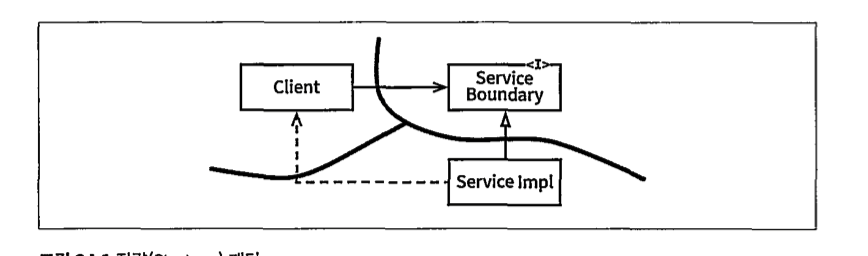
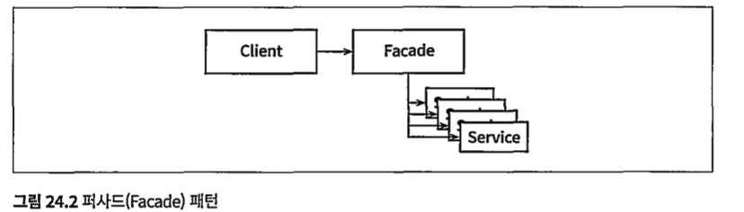
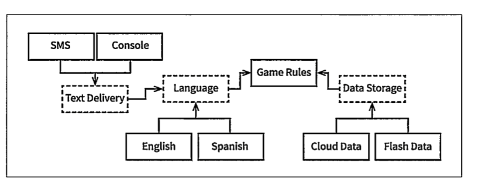
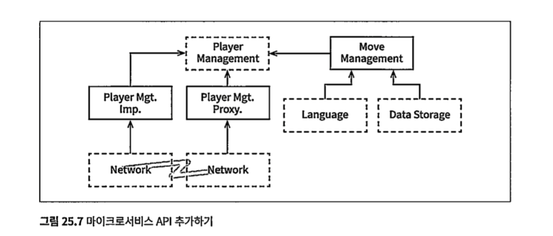
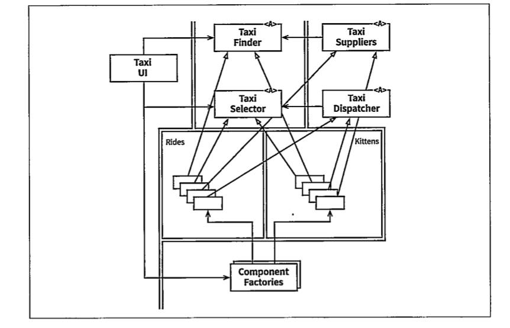
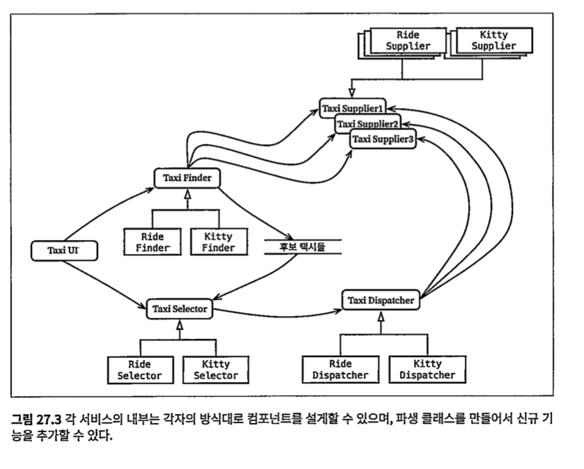

## 24장 부분적 경계
- 아키텍처 경계를 만드려면 비용이 많이 든다.
- "그래 어쩌면 필요할지도"라는 생각이 든다면 부분적 경계를 고려하라.

### 마지막 단계를 건너뛰기
- 독립적으로 컴파일하고 배포할수 있는 컴포넌트를 만들기 위한 작업 후 단일 컴포넌트를 모아두라.
  - 두개로 분리되었지만 두번 다운로드해야하는가?
  - 별도 분리한 컴포넌트가 과연 재사용할까? 
  - 분리하는 작업은 따분해진다!

### 일차원 경계
- 양방향 (쌍방향) 격리된 상태는 유지하는 비용이 많이든다.

- 비밀통로가 편하지만 제대로 훈련되어야 한다.

### 퍼사드
- 더 단순한 경계는 퍼사드 패턴
- Facade 클래스에 모든 서비스 클래스를 메서드 형태로 정의
- 서비스 호출이 발생하면 그때 호출 전달
  - 정적 언어라면 서비스 클래스 중 하나라도 변경되면 무조건 재컴파일 필요
- 비밀 통로도 만들기 쉽다

### 결론
- 경계를 언제 어디에 존재해야할지 그 경계를 구분짓는건 아키텍트의 역할

## 계층과 경계

### 움퍼스 사냥게임
- 적절한 의존성 방향을 가르키자

### 클린아키텍처

### 흐름 횡단하기
- 흐름은 여러개 일수 있다. 
- Language, Data Storage, Network etc...

### 흐름 분리하기
- 마이크로 서비스로의 형태의 아키텍처 경계로 진화할 수 있다.

### 결론
- 제대로된 경계는 비용이 많이든다.
  - 언제 필요한지 신중히 구분하자.
- 오버 엔지니어링이 언더 엔지니어링 보다 나쁠때가 훨씬 많다.
  - 정말로 필요한가?
- 비용을 산정하고 설계하라
  - 구현 비용이 무시해서 생기는 비용의 변곡점을 찾는게 아키텍처의 역할

## 26장 메인 (Main) 컴포넌트
- 나머지 컴포넌트를 생성, 조정, 관리하는 컴포넌트

### 궁금적인 세부사항
- 가장 낮은 수준의 정책
- 시스템의 초기 진입점
- 시스템 전반을 생성후 더 높은 수준의 담당
- 메인은 클릭아키텍처에서 가장 바깥 원에 위치하는 저수준의 모듈
  - @SpringBootApplication
  
### 결론
- 외부자원, 설정을 모두 수집하여 제어권을 애플리케이션 고수준 정책으로 넘기는 플러그인을 메인 컴포넌트라고 한다.
- 애플리케이션 설정별 하나씩 두도록 한다. 둘이상도 가능
  - API
  - 배치
  - 국가별
  - 테스트별 등등

## 27장 크고 작은 모든 서비스들
왜 인기가 많지?
- 상호 결합이 철저히 분리되어 보인다. (일부 맞다)
- 개발과 배포 독립성을 지원한다. (일부 맞다)

### 서비스 아키텍처
- 시스템의 아키텍처는 의존성 규칙을 준수, 고수준의 정책을 저수준으로 부터 분리한다.
- 결국 서비스는 프로세스나, 플랫폼을 가로지는 함수 호출에 지나지 않는다.

### 서비스의 이점?
- 결합 분리의 오류
  - 서비스는 개별 변수 수준에서는 각각의 분리된다.
  - 하지만 네트워크 상의 공유자원 떄문에 결합될 가능성은 여전히 존재
    (ex. Enum?Code?)
- 개발 및 배포 독립성의 오류
  - 전담팀에서 각 서비스를 운영하지만 대규모 시스템을 모놀리틱으로도 구축할 수도 있다.
  - 어느 정도 결합되어 있다면 개발/배포/운영을 조정 해야한다.
    (ex. 배포시간)

### 객체가 구출하다

- 복잡한 택시 통합 서비스를 구현 서비스를 템플릿 메서드나 전략 패턴을 사용하여 재배치

### 컴포넌트 기반 서비스
- 서비스도 이렇게 할 수 있을까?
  - 그렇다.

  - 각 서비스의 내부는 자신만의 컴포넌트 설계로 되어 있고 파생 클래스를 만드는 방식으로 신규 기능을 추가할 수 있다.
### 횡단관심사
  - 아키텍처 경계가 서비스 사이에만 있지는 않다.
  - 서비스를 컴포넌트 단위로 분할한다.
  - 그 자체로 아키텍처적으로 중요한 요소는 아니다. 

## 28장 테스트 경계
- 테스트도 시스템의 일부다.
### 시스템 컴포넌트인 테스트
- 아키텍처 관점에서 모든 테스트가 동일하다.
- 테스트는 태생적으로 의존성 규칙을 따른다.
- <b>어떠한 테스트에도 의존하지 않는다. 그리고 독립적 배포가 가능하다</b>

### 테스트를 고려한 설계
- 시스템에 강하게 결합된 테스트는 좋지 않다. (깨지기 쉬운 테스트)
- 변동성이 있는것에 의존하지 말라. (GUI를 사용하지 말라)

### 테스트 API
- 테스트가 모든 업무 규칙을 검증하도록 특화된 API를 만들라
- 테스트 API는 테스트를 애플리케이션으로부터 분리할 목적으로 사용한다.

### 구조적 결합
- 모든 상용클래스에 각각의 테스트 클래스가 존재
- 따로따로 진화가능하고 시간이 지날수록 더욱더 테스트는 견고해질 것이다.

### 보안
- 테스트 API 자체와 테스트 API 중 구현부는 독립적 배포 컴포넌트로 분리하라.

### 결론
- 테스트는 시스템 일부다.
- 잘 설계하고 꺠지기 어렵게 유지보수가 쉬워야 버려지지 않는다.

