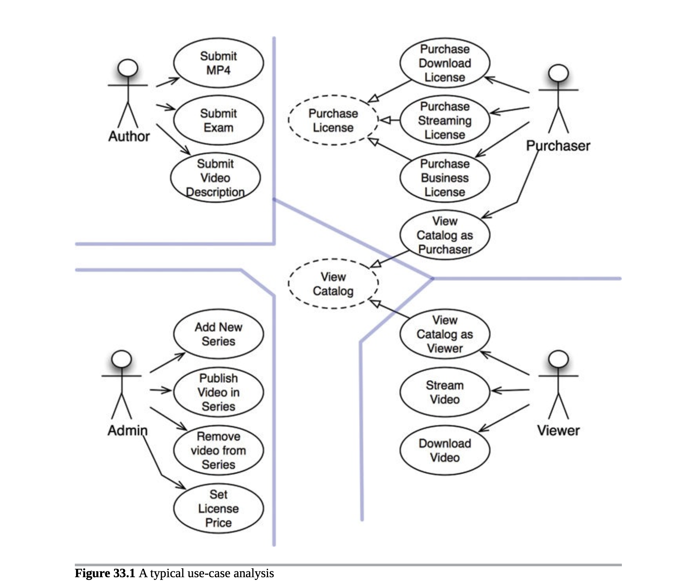
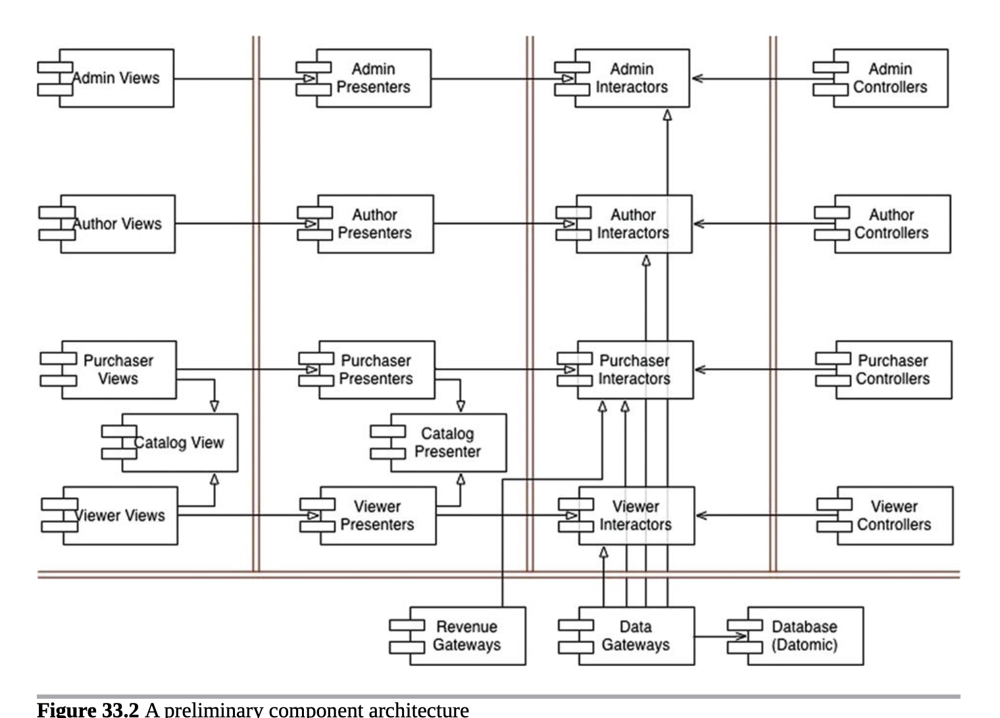
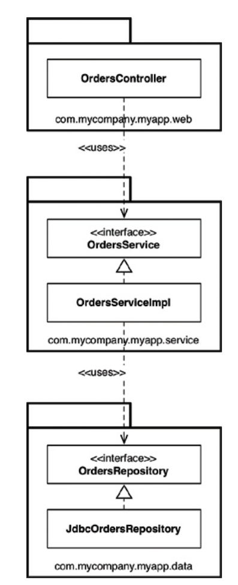
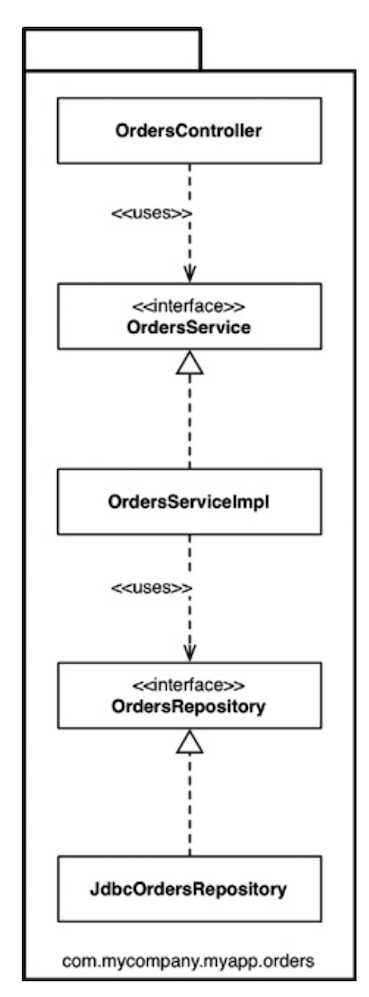
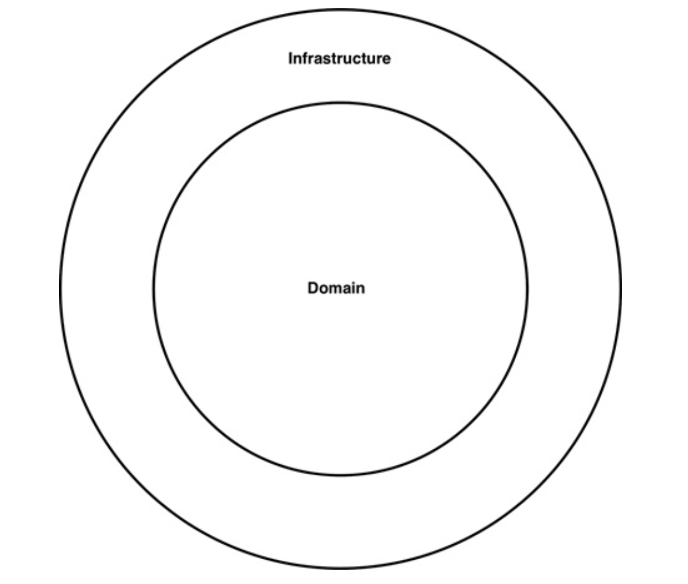
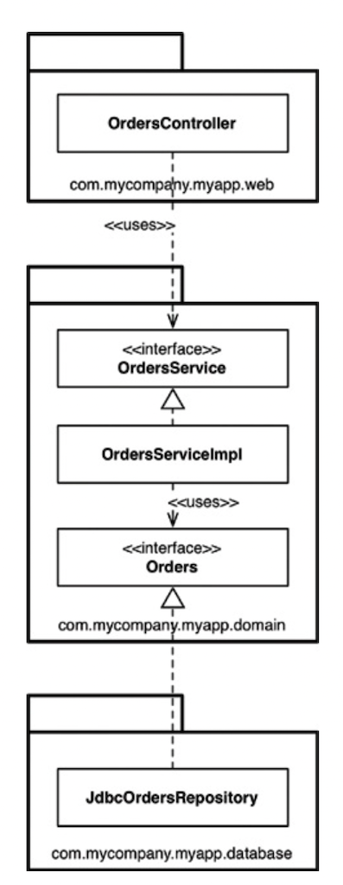
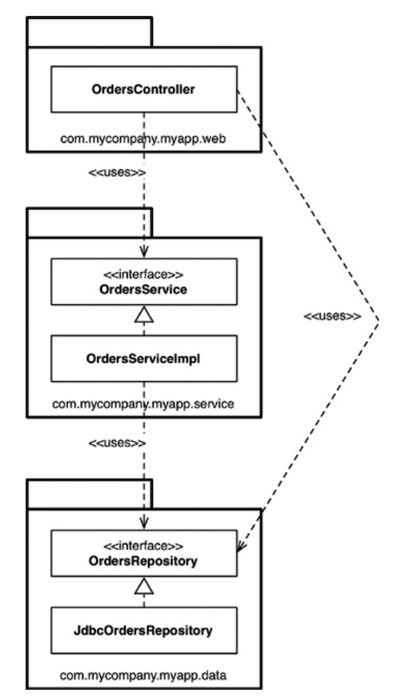
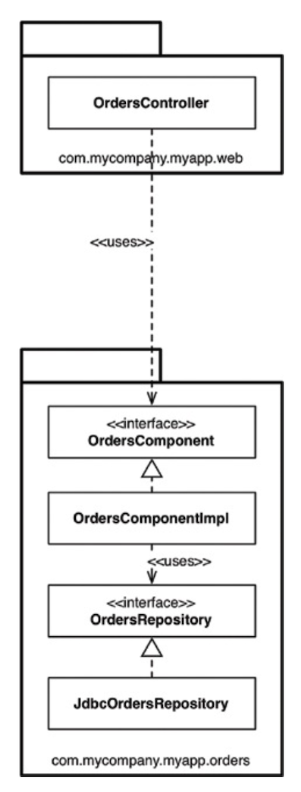

# 29장 클린 임베디드 아키텍처

- 소프트웨어는 닳지 않지만, 펌웨어와 하드웨어에 대한 의존성을 관리하지 않으면 안으로부터 파괴될 수 있다.
- 하드웨어는 발전할 수 밖에 없고, 그러한 현실을 염두에 두고 임베디드 코드를 구조화 해야 한다.

## 앱-티튜드 테스트

- 소프트웨어를 구축하는 세 가지 활동
  - 먼저 동작하게 만들어라
  - 그리고 올바르게 만들어라
  - 그리고 빠르게 만들어라
- 임베디드 시스템은 대부분 동작하게 하라는 활동만 염두에 두고 작성한 것처럼 보인다
- 앱티튜드라는 말은 그냥 앱이 돌아가게만 만드는 걸 의미
  - 좋은 의미가 아님
- 이런식으로 개발해선 안된다

## 타깃-하드웨어 병목 현상

- 임베디드 개발자는 임베디드 개발자가 아니면 몰라 도 될 관심사를 많이 갖고 있다.
- 예를 들면 메모리 공간, 실시간성 제약과 처리완료 시간 등
- 임베디드 개발자는 특별하긴 하지만, 이 책에 나온 기법들을 적용 못할 정도로 특별하진 않다
- 클린 임베디드 아키텍처는 테스트하기 쉬운 임베디드 아키텍처이다

## 결론

- 좀 더 자세한 설명이 나오지만 임베디드에 관련된 내용이라 생략
- 결국 임베디드건 소프트웨어 개발자건 클린 아키텍처를 지향해야 한다

# 30장 데이터베이스는 세부사항이다

- 아키텍처 관점에서 데이터베이스는 엔티티가 아님

## 관계형 데이터베이스

- 관계형 데이터 베이스는 아주 잘만든 기술이지만, 결국은 그냥 기술로 세부사항이다.
- 관계형 테이블은 특정한 형식의 데이터에 접근하는 경우에 매우 편하지만, 데이터를 테이블에 행 단위로 배치한다 라는 사실 자체는 아키텍처 적으로 볼 때 별 상관없다.
- 즉 세부사항

## 데이터베이스 시스템은 왜 이렇게 널리 사용되는가?

- '디스크' 때문에 널리 사용됨
- 디스크 기술의 치명적인 단점은 `느리다`라는 것
- 이러한 느린 단점을 커버하기 위해 나온 관리 툴이 데이터베이스

## 디스크가 없다면 어떻게 될까?

- 디스크는 소멸중
- RAM으로 대체될 것
- 모든 데이터가 RAM으로 저장된다면 데이터 구조로 체계화 할 것
- 데이터에 접근할 때는 포인터나 참조를 사용할 것이다.

## 세부사항

- 데이터베이스가 세부사항이라고 말하는 이유가 바로 이러한 이유
- 메커니즘에 불과하고, 디스크 표면과 RAM 사이에서 데이터를 이리저리 옮길 때나 사용하는 툴이다.
- 즉 언젠간 없어질 수도 있는 기술

## 하지만 성능은?

- 성능은 아키텍처 관점에서 매우 중요하지만, 데이터 저장소의 측면에서 성능은 완전히 캡슐화가 되어 있는 분리할 수 있는 관심사 이다.
- 성능 자체가 전반적인 아키텍처와는 관계가 없다.

## 결론

- 데이터베이스는 세부사항이다

# 31장 웹은 세부사항이다

## 끝없이 반복하는 추

- IT 역사 전체로 시야를 넓히면 웹은 아무것도 바꾸지 않았다.
- 아키텍트로서 우리는 멀리 내다봐야 한다.

## 요약

- GUI는 세부사항이다.
- 웹은 GUI다
- 따라서 웹은 세부사항이다
- 아키텍트라면 이러한 세부사항을 핵심 업무 로직에서 분리된 경계 바깥에 두어야 한다.
- 물론 웹은 아주 복잡해서 단순히 장치 독립성을 말하기엔 비현실 적이라고 주장할 수도 있다.
- 어느정도는 옳긴 하지만, UI와 애플리케이션 사이에는 추상화가 가능한 또 다른 경계가 존재한다.
- 즉 분리해서 생각해야 한다

# 32장 프레임워크는 세부사항이다

- 프레임 워크도 세부사항이다

## 프레임워크 제작자

- 프레임워크 개발자는 자신이 해결해야 할 고유한 문제나 자신의 동료와 친구들의 문제를 알고 있다.
- 그런 문제 해결을 위해 만드는거지 우리를 위해 만드는게 아니다.(?)
- 물론 겹치는 부분이 있을거고, 겹치는 부분이 많을 수록 더 유용해진다

## 혼인 관계의 비대칭성

- 우리와 프레임워크 제작자 사이의 관계는 비대칭적
- 우리는 프레임워크 제작자가 제공하는 문서를 꼼꼼히 읽는다.
- 근데 프레임워크 제작자는 그냥 제공하고, 그에 맞춰 우리가 맞춰서 개발하라고 강요(?) 한다.
- 일방적인 혼인관계.. 

## 위험 요인

- 프레임워크의 아키텍처는 그다지 깔끔하지 않을 수 있다.
- 의존성 규칙을 위반하는 경우가 매우 많다
- 강결합을 요구하는 경우가 많음
- 프레임워크는 초기 기능을 만드는데는 도움이 되지만, 제품이 성숙해지면 프레임워크의 틀에서 벗어난다
- 프레임워크 자체가 우리에게 도움이 되지 않는 방향으로 진화할 수 있다
- 더 나은 프레임워크가 나타나면 갈아타고 싶어짐

## 해결책

- 프레임워크와 결혼하지 말라
- 프레임워크가 아키텍처의 안쪽 원으로 들어오지 못하게 해야한다.
- 즉 세부사항으로 취급하라는 것
- 의존성 규칙을 준수하도록 취급
- 프레임 워크 기반 클래스로부터 파생하길 원하면, 프록시같은걸 만들어서 분리시켜라
- 스프링
  - 스프링은 매우 훌륭한 의존성 주입 프레임워크
  - 오토와이어링 등을 사용할 것이다
  - 하지만 업무 객체는 절대로 스프링에 대해서 알아서는 안된다. -> 생성자 주입등을 활용
  - 업무 객체보다는 메인 컴포넌트에서 스프링을 사용해서 의존성을 주입하는 편이 낫다 -> configuration 파일
  - 메인은 아키텍처 내에서 가장 지저분한, 최저 수준의 컴포넌트이기 때문에 스프링을 알아도 크게 상관 없다

## 이제 선언합니다

- 언어마다 꼭 필요한 프레임워크, 라이브러리가 존재한다
- 자바 표준라이브러리 같은
- 하지만 항상 `선택적`이어야 한다

## 결론

- 세부사항이다.

# 33장 사례 연구: 비디오 판매

## 제품

- 웹 사이트에서 비디오를 판매하는 소프트웨어
- 구조는
  - 판매하길 원하는 비디오들이 있고, 그걸 개인과 기업에게 웹을 통해 판매한다
  - 개인은 단품 가격을 지불해 스트리밍으로 보거나, 더 높은 가격을 내고 비디오를 다운로드해서 영구 소장도 가능
  - 기업용 라이센스는 스트리밍 전용이며, 대량 구매를 하면 할인을 받을 수 있다.

## 유스케이스 분석

- 액터는 4개
- 단일 책임 원칙에 따라 이 네 액터가 시스템이 변경되어야 할 주요 근원
- 제작자, 구매자, 관리자, 시청자
- 따라서 시스템을 분할하여, 특정 액터를 위한 변경이 나머지 액터에게는 전혀 영향을 미치게 안들게 만든다
- 위의 그림은 완벽하지 않음
- 로그인이나 로그아웃같은 유스케이스가 없음
- 복잡한걸 줄이려고 뺐음
- 중앙의 점선으로 된 유스케이스는 추상 유스케이스 -> 범용적인 정책을 담고 있다
  - 다른 유스케이스에서 이를 더 구체화 한다

## 컴포넌트 아키텍처

- 예비 단계의 컴포넌트 아케틱처
- 이중으로 된 선은 아키텍처 경계
- 뷰 / 프레젠터 / 인터랙터 / 컨트롤러로 분리
- 각 컴포넌트는 단일.jar 파일 또는 .dll 파일에 해당
- catalog view와 catalog presenter를 보면, 저자의 특수한 추상 유스케이스 처리 방식
- 여기서 다 단일 .jar로 분할한다고 했지만, 실제로 꼭 그럴필요는 없다.
- 어떻게 나눌지는 상황에 따라 다르게 가져가야 한다

## 의존성 관리

- 제어흐름은 오른쪽에서 왼쪽으로 이동
- 입력이 컨트롤러에서 발생하면 인터랙터에 의해 처리되어 결과가 만들어진다
- 프레젠터가 결과의 포맷을 변경 후 뷰가 화면에 표시
- `의존성 규칙`을 아주 잘 준수 한다
- 모든 의존성은 경계선을 한 방향으로만 가로지른다. (양방향 화살표가 없음)
- 또 사용관계(열린 화살표)는 제어흐름과 같은 방향을 가리키며, 상속 관계(닫힌 화살표) 는 제어흐름과는 반대 방향으로 가르킨다
- 개방 폐쇄 원칙을 지킨 형태이다 (인터페이스 형태)

## 결론

- 단일 책임 원칙에 기반한 액터의 분리
- 의존성 규칙
- 위의 두 차원의 분리 개념을 적용한 구조이다

# 34 빠져 있는 장

- 디테일에 대한 설명

## 계층 기반 패키지

- 전통적인 수평 계층형 아키텍처
- 기술적인 관점에서 해당 코드가 하는 일에 기반해 코드를 분할
- 보통 웹, 업무 규칙, 영속성 코드 계층 으로 나눈다
- 각 계층은 유사한 종류의 것들을 묶는 도구로 사용
- 엄격한 계층형 아키텍처의 경우 반드시 아래 계층에만 의존해야 한다

- 유용한 방식이지만, 소프트웨어가 복잡해지면 3개만으로 부족해 진다.
- 또한 업무 도메인에 대해 아무것도 말해주지 않는 문제점이 있다

## 기능 기반 패키지

- 서로 연관된 기능끼리 묶는 패키지 기법

- 인터페이스와 클래스는 이전과 같지만, 모두가 단 하나의 패키지에 속하게 된다.
- 계층 기반을 간단하게 리팩토링한 형태지만, 상위 수준 구조가 업무 도메인에 대해 어떤것인지 알려준다.
- 이렇게 하면 소스 변경시 변경해야 될 코드를 찾기가 쉬워진다.
- 근데 이건 결국 차선책
- 더 좋은 방법이 있다

## 포트와 어댑터

- 포트와 어댑터 또는 육각형 아키텍처(헥사고날) 등을 사용하는 이유는 업무/도메인에 초점을 둔 코드가 프레임워크나 데이터베이스 같은 기술적인 세부 구현과 독립적이며 분리된 아키텍처를 만들기 위해서.

- 내부 도메인과 외부 인프라를 분리
- 내부는 도메인 개념을 모두 포함, 외부는 외부 세계(UI, DB, 서드파티 등)와의 상호작용을 포함한다.
- 제일 중요한 건 외부가 내부에 의존하며, 절대로 그 반대는 안된다는 것 (의존성 역전)

- 컨트롤러와 디비접근 레포지토리가 서비스패키지에 의존하고 있다. 
- OrderRepository가 Orders라는 간단한 이름으로 변경되었다
- 도메인 주도 설계라는 세계관에서 비롯된 명명법
- 도메인 주도 설계에서는 내부에 존재하는 모든 것의 이름은 반드시 `유비쿼터스 도메인 언어`관점에서 기술해야 한다
- 도메인에 대해 논의할 때 우리는 주문에 대해 말하지 주문 레파지토리에 대해서 얘기하는게 아니기 떄문이다
- 위 그림은 인터랙터가 빠졌고, 의존성 경계를 가로질러 데이터를 마샬링하는 객체가 누락되었다

## 컴포넌트 기반 패키지

- 계층형은 안좋다
  - 다른 패키지 계층에 접근하기 위해서 반드시 public으로 선언해야 됨
  - 잘못된 의존 관계가 형성될 수 있음
  - 계층을 뛰어 넘어서 의존하고 난리남

- 제대로 계층 안나누면 새로 온 개발자건 바쁜 사람이건 이런식으로 이상한 구조가 될 수 있다
- 즉 웹 컨트롤러는 레포지토리에 절대 접근하면 안된다 라는 룰이 있는데
- 이게 강제성이 없어서 생기는 문제
- 여러 툴을 사용해서 (조잡하지만) 강제성을 두게 할 수 있다
- 문제는 필요이상으로 길고, 오류가 생길 수도 있다.
- 가능하면 컴파일 타임에 아키텍처를 강제하는 방식이 더 낫다
- 컴포넌트 기반 패키지를 도입해야하는 이유
- 큰 단위의 단일 컴포넌트와 이와 관련된 모든 책임을 하나의 자바 패키지로 묶는데 주안점을 둔다

- 업무 로직과 영속성 관련 코드를 하나로 묶는데, 이 묶음을 컴포넌트 라고 부른다
- 저자가 말하는 컴포넌트의 정의는
  - 멋지고 깔끔한 인터페이스로 감싸진 연관된 기능들의 묶음으로 어플리케이션과 같은 실행 환 내부에 존재한다

## 구현 세부사항엔 항상 문제가 있다

- 우리는 public을 아주 방만하게 쓴다
- 모든 타입에서 public을 사용하는건 캡슐화의 이점을 버리겠다는 뜻

## 조직화 vs 캡슐화

- 만약 죄다 public을 쓰고 있으면 패키지는 그냥 조직화를 위한 매커니즘(폴더처럼) 정도로만 쓰이게 된다
- 캡슐화를 위한 매커니즘이 안된다는 것
- 즉 패키지를 쓰는 이점이 거의다 사라지는 것
- 패키지별로 제한적인 접근자를 잘 써야 한다. -> protected

## 다른 결합 분리 모드

- 언어가 제공하는 방법 외에도 소스코드 의존성을 분리하는 방법은 존재할 수 있다.
- OSGi 같은 모듈 프레임워크나 자바9에서 제공하는 새로운 모듈 시스템 등
- 모듈 시스템을 제대로 사용하면 public 타입과 외부에 공표할 타입을 분리할 수 있다
- 예를 들어 Orders모듈을 생성할 때 public을 때려박아도 일부 타입만을 외부에서 사용할 수 있게 공표가 가능하다
- 아주 좋다
- 다른 선택지로는 소스코드 수준에서 의존성을 분리하는 방법이 있다
- 정확하게는 `서로 다른 소스코드 트리`로 분리하는 방법
- 너무 장황하게 나누면 현실적으로 어려우므로
  - 도메인 코드(내부)
  - 인프라 코드(외부)
- 정도로 나누는게 좋다

## 결론: 빠져 있는 조언

- 설계를 어떻게 해야 원하는 코드 구조로 매핑할 수 있을지, 그 코드를 어떻게 조직화할지, 런타임과 컴파일타임에 어떤 결합 분리 모드를 적용할 지 고민이 필요하다